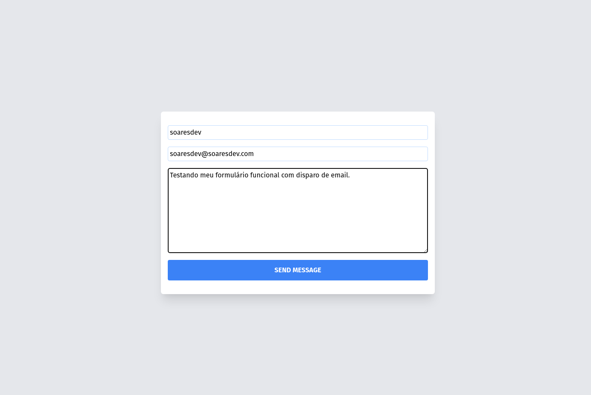
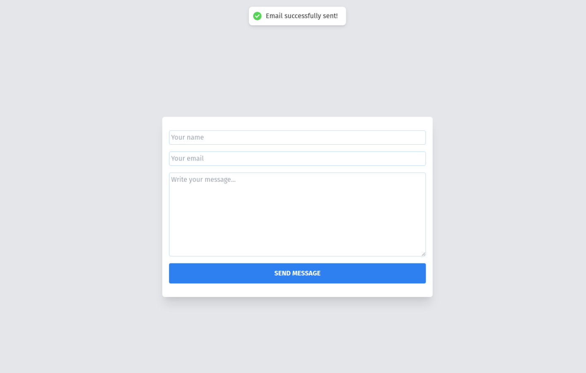
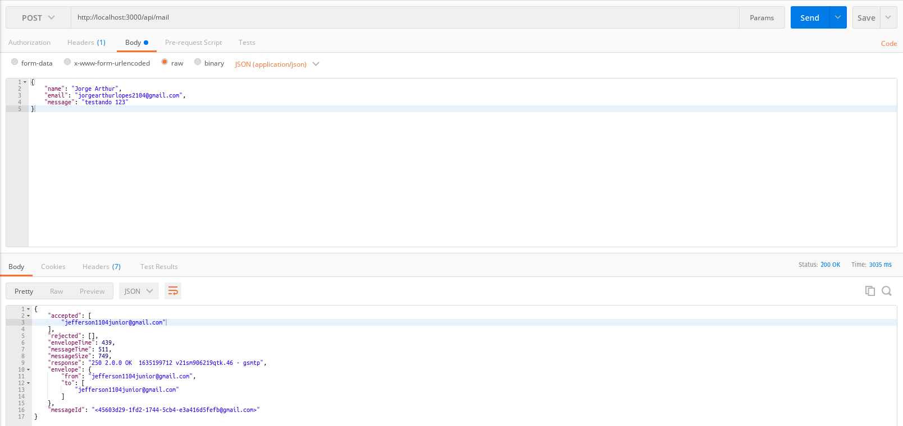
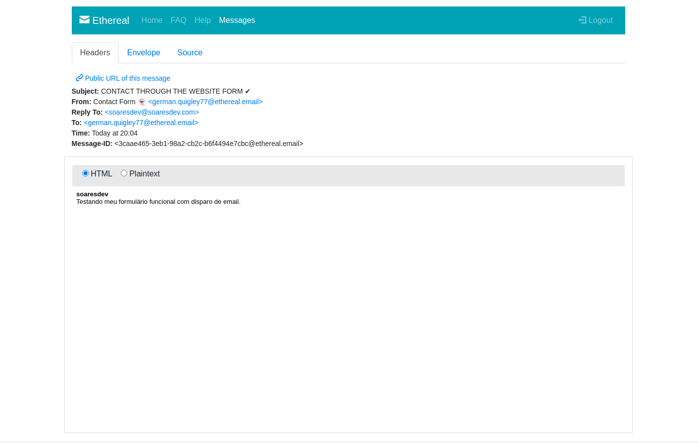

<h1 align="center">
  CONTACT FORM
</h1>

<p align="center">
  

  

  
</p>

# 💻 About project

Thanks to the BFF and serverless feature of NextJS I built a functional form with data submission via email, in the development the main technologies were used: typescript, nextjs, axios, nodemailer and tailwindcss.

# 🚀 How to run the project

```bash
# Clone this repository
$ git clone https://github.com/jefferson1104/contactFormMail-nextjs.git

# Configure nodemailer transporter through .env
change .env.local.example to .env.local

# Enter your provider's email setting in .env.local

# Run project
$ yarn dev
```

# 🎨 Screenshots





